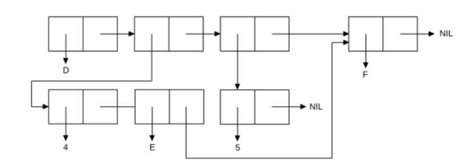

<p align="center"><b>МОНУ НТУУ КПІ ім. Ігоря Сікорського ФПМ СПіСКС</b></p>
<p align="center">
<b>Звіт з лабораторної роботи 1</b><br/>
"Обробка списків з використанням базових функцій"<br/>
дисципліни "Вступ до функціонального програмування"
</p>

<p align="right"> 
<b>Студентка</b>: 
<em> КВ-21 Оваденко Владислава </em></p>

<p align="right"><b>Рік</b>: <em>2025</em></p>

## Загальне завдання
1. Створіть список з п'яти елементів, використовуючи функції LIST і CONS . Форма
створення списку має бути одна — використання SET чи SETQ (або інших
допоміжних форм) для збереження проміжних значень не допускається. Загальна
кількість елементів (включно з підсписками та їх елементами) не має
перевищувати 10-12 шт. (дуже великий список робити не потрібно). Збережіть
створений список у якусь змінну з SET або SETQ. Список має містити (напряму
або у підсписках): хоча б один символ, хоча б одне число, хоча б один не пустий підсписок, 
хоча б один пустий підсписок.
2. Отримайте голову списку.
3. Отримайте хвіст списку.
4. Отримайте третій елемент списку.
5. Отримайте останній елемент списку.
6. Використайте предикати ATOM та LISTP на різних елементах списку (по 2-3
приклади для кожної функції).
7. Використайте на елементах списку 2-3 інших предикати з розглянутих у розділі 4
навчального посібника.
8. Об'єднайте створений список з одним із його непустих підсписків. Для цього
використайте функцію APPEND .

```lisp
;; Пункт 1 
CL-USER> (defvar lab-list nil)
LAB-LIST
CL-USER> (setq lab-list (cons 'A (cons 'B (cons 1 (cons 2 (cons (list 'K 'V '2 '1) (list nil)))))))
(A B 1 2 (K V 2 1) NIL)

;; Пункт 2 
CL-USER> (car lab-list)
A

;; Пункт 3 
CL-USER> (cdr lab-list)
(B 1 2 (K V 2 1) NIL)

;; Пункт 4
CL-USER> (nth 2 lab-list)
1

;; Пункт 5
CL-USER> (last lab-list)
(NIL)

;; Пункт 6
;;ATOM
CL-USER> (atom (nth 1 lab-list))
T
CL-USER> (atom (nth 4 lab-list))
NIL
CL-USER> (atom (last lab-list))
NIL

;;LISTP
CL-USER> (listp (nth 1 lab-list))
NIL
CL-USER> (listp (nth 4 lab-list))
T
CL-USER> (listp (last lab-list))
T

;; Пункт 7
;;EQL
CL-USER> (eql (nth 0 lab-list) 'A)
T

;;EQUAL
CL-USER> (equal (nth 4 lab-list) (list 'K 'V '2 '1))
T

;;=
CL-USER> (= (nth 2 lab-list) 5)
NIL

;; Пункт 8
CL-USER> (append lab-list (nth 4 lab-list))
(A B 1 2 (K V 2 1) NIL K V 2 1)
```

## Варіант 5
<p align="center"></p>

### Лістинг команди конструювання списку та результат її виконанння
```lisp
CL-USER> (defvar list1 nil)
LIST1
CL-USER> (defvar list2 nil)
LIST2
CL-USER>  (setq list2 '(4 e f) list1 (list* 'd list2 (list 5) (last list2)))
(D (4 E F) (5) F)
```